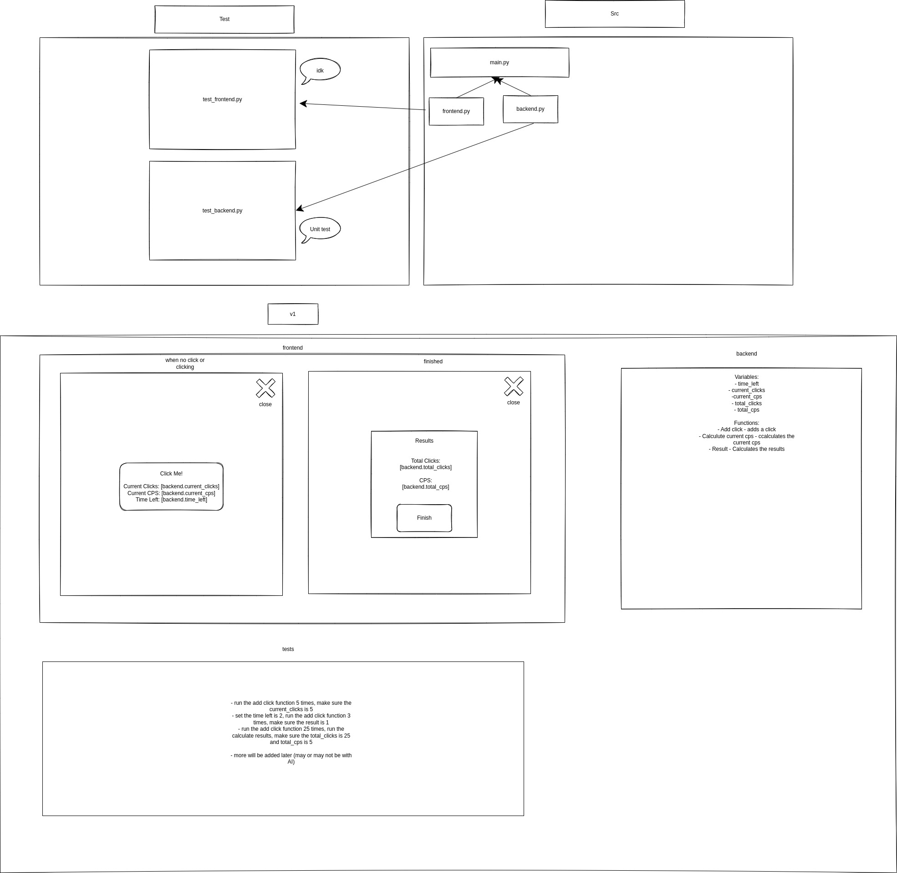

# Another CPS Tester

## Dependencies

```shell
pip install flet[all]
pip install pylint

```

## How to Use

```shell
python3 main.py
```

## Design

The backend code is a test driven design

### V1



> Diagram made with drawio (zoom for better view)
